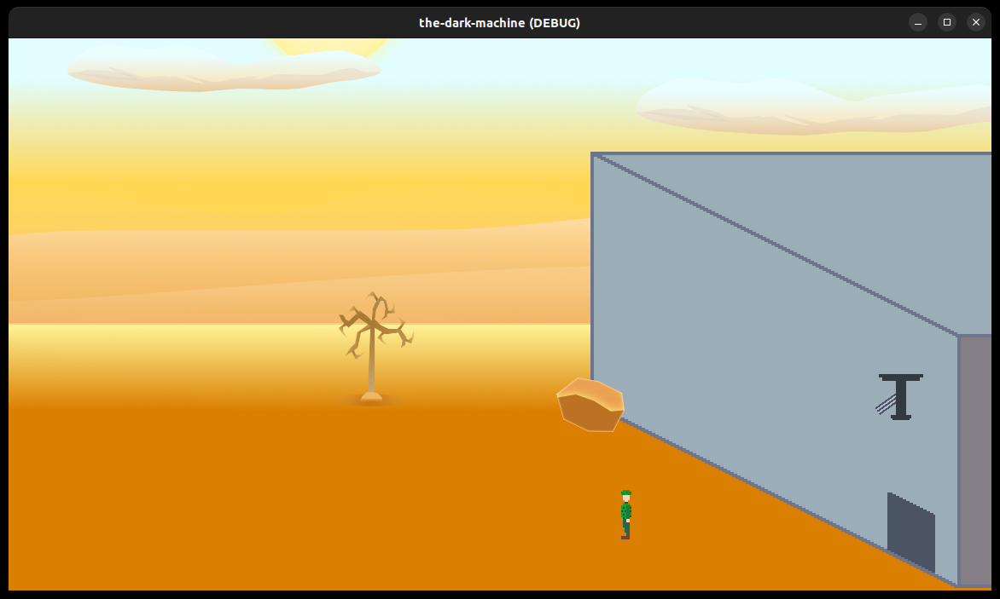

= TheDarkMachine

This is/was for a game jam running from July 12th to July 19th. The theme is `0 Days Since Last Accident`, with a secondary optional restriction of `Day and Night`. It's a Godot 4 web game; you can play it on GitHub Pages by clicking the link in the description.

I'm doing daily livestreams of my progress over on https://www.youtube.com/playlist?list=PLbH4r1N8PmBJCQXXpTDiY8UOEldlRK8bM[YouTube].

In this game, I'm interpreting that as you're trying to get deeper and deeper into a secret spooky government research facility, and you do that by triggering a number of unfortunate ""accidents"" that happen to the occupants that allow you to get further in and discover The Secret at the heart of _The Dark Machine_.

The game plays as a kind of hyperviolent https://en.wikipedia.org/wiki/The_Incredible_Machine[The Incredible Machine] in which you have to use available parts and environmental conditions to set up what are essentially traps for the unfortunate denizens of this secret base.

I'm not sure if it'll work, but we'll see!

== Licensing

Eh, feel free to rip off any of the code you like, but the art isn't all mine, so check for source text files on those first.